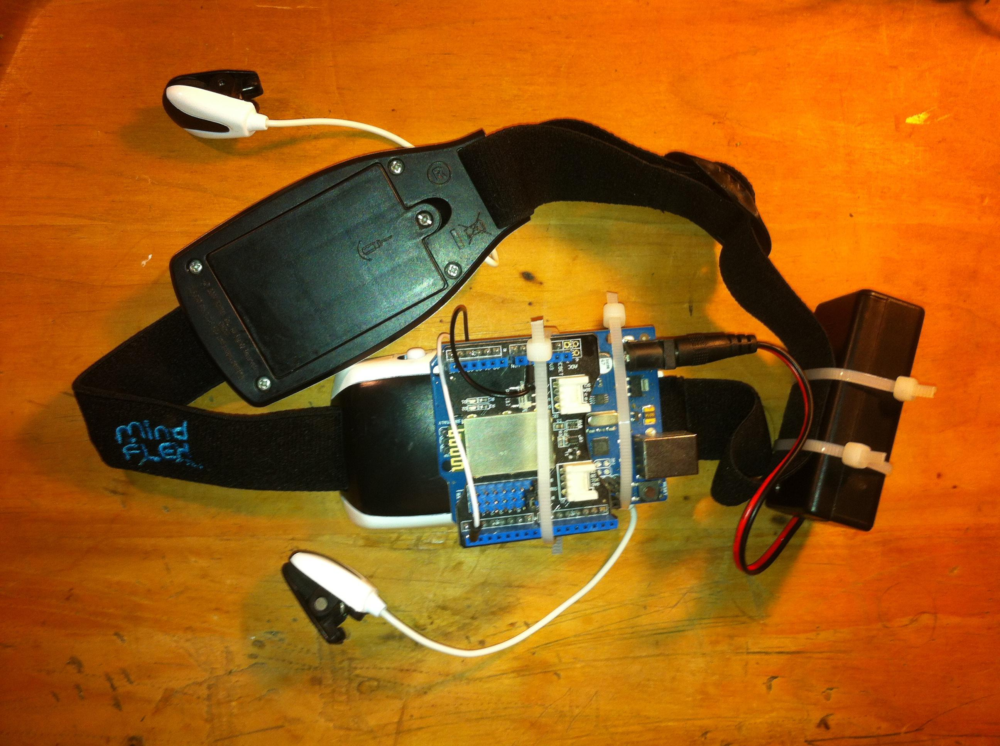

# Overview #

[Click here](https://www.youtube.com/watch?v=Wx5tyzQI1Mc) for a video demonstrating the visualization.

This project utilizes a Bluetooth-enabled Arduino EEG, made from a hacked Neurosky headband originally included in the Mindflex game by Mattel. The Arduino EEG sends brain data to [Processing](https://processing.org) through a [“Seeeduino” Bluetooth Shield](http://wiki.seeedstudio.com/wiki/Bluetooth_Shield), where it controls parameters for a 3D implementation of Conway’s Game of Life. Birth and death rules have been modified and cells manifest as either spheres or cubes of various sizes. Brain waves control the sketch by affecting the colors and opacities of individual cells in addition to altering the angles of rotation on all three axes of the entire swarm. As the angles of rotation change over time, the swarm is seen from a multitude of different perspectives, ultimately producing a diverse assortment of visual patterns with varying color schemes. A higher “Meditation” value zooms inward. A higher “Attention” value increases the amplitude of an underlying ambient composition that otherwise loops indefinitely just outside the bounds of perception.

This project adapted code from:

[BrainGrapher](https://github.com/kitschpatrol/BrainGrapher) -- for the Processing side of reading the EEG data from the serial port

[Arduino EEG Library](https://github.com/kitschpatrol/Brain) -- for collecting the EEG data with an Arduino

For more information on the hardware hack and data structure, please refer to the following link:

[Arduino EEG "Brain Hack" Documentation](http://www.frontiernerds.com/brain-hack)

